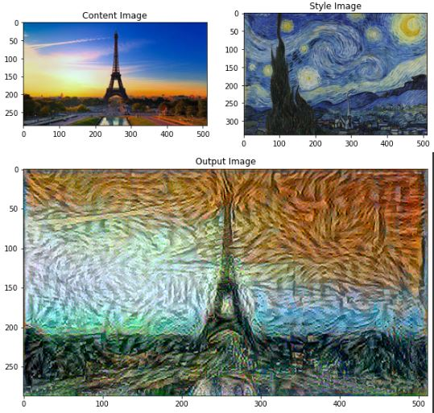
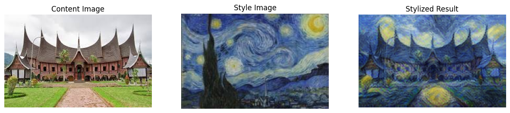

#  Art Generation using Neural Style Transfer

Proyek ini menerapkan algoritma *Neural Style Transfer* (NST) untuk menciptakan gambar artistik dengan menggabungkan **konten dari satu gambar** dan **gaya dari gambar lain**. Implementasi menggunakan model VGG19 dan dijalankan dalam lingkungan Python melalui Jupyter Notebook.

##  Struktur Proyek

- `Art_Generation.ipynb`: Notebook utama dari repo asli.
- `neural_style_transfer.py`: Versi modifikasi  dengan peningkatan kualitas output.

##  Fitur Asli

- Menggunakan pretrained VGG19 dari Keras untuk ekstraksi fitur.
- Menentukan *loss* untuk konten dan gaya menggunakan layer-layer tertentu.
- Menggunakan Adam optimizer untuk menyesuaikan gambar hasil.
- Menampilkan hasil akhir berupa gambar dengan gaya baru.

##  Perubahan & Modifikasi

Berikut adalah modifikasi yang telah dilakukan dalam notebook `neural_style_transfer.py`:

-  **Penyetelan ulang rasio konten dan gaya** agar hasil lebih seimbang.
-  **Penambahan normalisasi dan pemrosesan awal** agar hasil lebih bersih.
-  **Visualisasi setiap beberapa iterasi** untuk memantau progres transfer gaya.
-  **Optimisasi kecepatan** dengan menggunakan loop training yang lebih efisien.

##  Cara Menjalankan

1. Buka `neural_style_transfer.py` file di Google Colab atau Jupyter Notebook.
2. Upload dua gambar: satu untuk konten, satu untuk gaya.
3. Jalankan semua sel dari atas ke bawah.
4. Lihat hasil akhir di bagian output.

##  Contoh Hasil

### Hasil Sebelum Dimodifikasi

### Hasil Setelah Dimodifikasi

##  Referensi

- [TensorFlow NST Tutorial](https://www.tensorflow.org/tutorials/generative/style_transfer)
- GitHub repo original: [Shruti-Raj-Vansh-Singh](https://github.com/Shruti-Raj-Vansh-Singh/Art-Generation-using-neural-style-tranfer)

---

– Ramdhan Fajar Prasetyo
